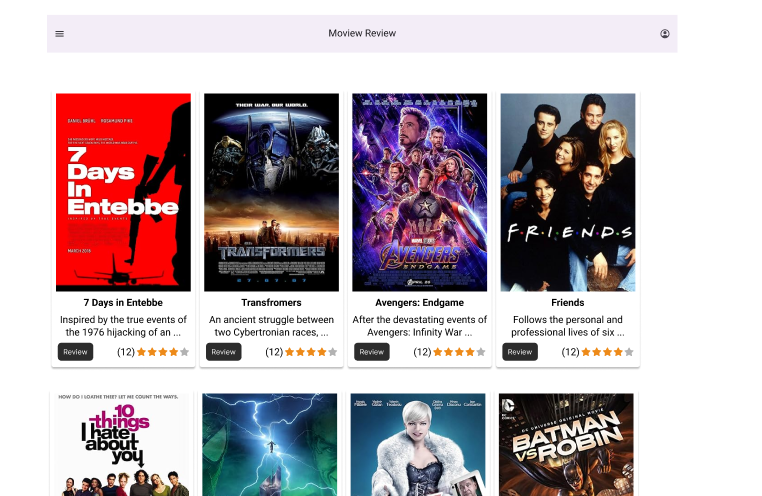
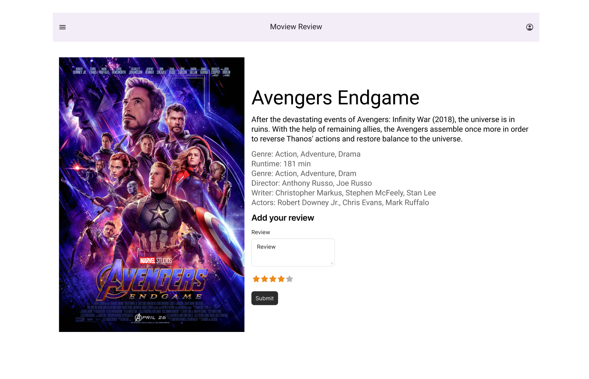

# Learning notes

This repository keeps tracks of all the notes and the labs for the this short course.
Please find the study plan in the [Notes](<Study plan.md>)

The course will be a 6 week packed program to get your understanding of the web from zero to intermediate level.
You will build a movie review web app where a user can create and account, search for movies and write their own custom reviews for the movie they have search.

The app might look a little bit like this
- Homepage

- Review page

The overview is as below;
## Week one
In this, you will get to better understand to programming. In this week all labs will help you better understand programming. You will also learning a bit of linux to help better understand commands and also you will learn docker in order to have your programs run the same way even on different devices.

## Week two
Week two will introduce to HTML and CSS the core the web. In this week, you will learn how use HTML markup language to create simple websites and web pages. And then build on the web pages you've made and make them more colorful and alive using CSS which is used to style websites.
You will also touch on the best to render websites and frameworks

## Week three
Week three we shall learn about Javascript and how it brings reactivity and life to our websites and web pages. You will learn basic concepts of how to access web resources (making api calls) and other system resources. You will also learn the different type of http requests and methods and what each is for.
## Week four
Wee four we shall go deeper in Javascript learn how to access the filesystem, handle input from the user and also handle events on the websites. Handling events enables us to know when a user clicks a button or scrolls a page on our website such that we can run some code to do something cool.

## Week five
Week five we shall learn how to use databases as a way for us to store data that we might need to access later on. We shall be able to create user accounts and store their details in the database. Also in week five, the users will be able to login and add their reviews. We shall learn they key concept of CRUD (Create, Read Update and Delete) for databases.

## Week six
In week six we shall be able to put everything we've learnt to save the reviews of the users and then we shall be able to deploy our simple app to the internet for other people to access.
If there happens anything else that we shall need to touch on, we can use this week as well to do so.

Note: Every week will have a lab that will build on what you've learned already as we put the project
